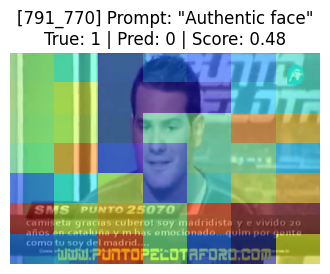

# Cross-Manipulation Deepfake Detection with CLIP 系列方法

## 1. 摘要

本專案探索三種 Vision-Language Model (VLM) 方案在 **NeuralTextures** 未見假臉類型上的泛化能力：

| 方法                      | Backbone          | 可訓練參數      | Prompt                                     | AUC       | EER       | Video Acc. |
| ------------------------- | ----------------- | --------------- | ------------------------------------------ | --------- | --------- | ---------- |
| **Baseline** Linear Probe | ViT-B/32 (Frozen) | 0.13 M (0.08 %) | —                                          | **0.603** | 0.441     | 0.817      |
| **LoRA + Prompt V1**      | ViT-B/32 + LoRA   | 2.36 M (1.54 %) | `"AI-Generated"` / `"Authentic"`           | **0.792** | 0.269     | 0.875      |
| **LoRA + Prompt V2**      | 同上              | 2.36 M (1.54 %) | `"AI-Generated face"` / `"Authentic face"` | **0.859** | **0.191** | **0.875**  |

> **結論**：
>
> 1. Frozen CLIP + 線性層不足以辨識跨類型偽造。
> 2. 僅改變 **prompt** 便可顯著提升 AUC / EER。
> 3. 使用 **face-aware prompt** 在相同 LoRA 參數下再推升 AUC 至 0.859，EER 降至 0.191。

## 2. 資料集與切分

```text
Real_youtube → 按 video 80 % / 20 % 切分
FaceSwap     → 全數加入 train
NeuralTextures → 僅在 val_loader
```

-   **Train**：Real_youtube-train frames + FaceSwap frames
-   **Val/Test**：Real_youtube-val frames + NeuralTextures frames
-   批次大小：train 32、val 1

## 3. 方法

### 3.1 Frozen CLIP + Linear (Baseline)

image → CLIP image encoder (frozen) → 512-d feature → Linear(512→2) → Softmax

### 3.2 LoRA + Prompt-Cosine (V1)

-   在 `q_proj / k_proj / v_proj / out_proj` 插入 **LoRA(r=32, α=64, dropout=0.05)**
-   Trainable ≈ 1.54 %
-   Cosine(sim(image_emb, text_emb)) × scale → softmax
-   Prompts：`["AI-Generated", "Authentic"]`

### 3.3 LoRA + Prompt-Cosine (V2)

-   **相同 LoRA 架構與權重數**
-   Prompt 強化為 `["AI-Generated face", "Authentic face"]` 以引導注意力聚焦面部區域

## 4. 實驗流程

-   Python：3.11+
-   GPU：建議使用含 CUDA 支援之 GPU
-   建議建構虛擬環境後執行以下安裝指令：
    ```bash
    pip install -r requirements.txt
    ```
-   dataset 下載: https://www.dropbox.com/t/2Amyu4D5TulaIofv

### 訓練與評估（clip_lora_train_eval.py）

```
python clip_lora_train_eval.py \
  --data_root ./data \
  --model_name openai/clip-vit-base-patch32 \
  --prompt0 "AI-Generated face" \
  --prompt1 "Authentic face" \
  --seed 42 \
  --epochs 5 \
  --lr 5e-5 \
  --lora_r 32 \
  --lora_alpha 64 \
  --lora_dropout 0.05 \
  --save_dir lora_checkpoints/sample_dir \
  --results_dir results/sample_dir \
  --mode train
```

### 訓練與評估（clip_linear_eval.py）

```
python clip_linear_eval.py \
  --data_root ./data \
  --epochs 3 \
  --lr 1e-4 \
  --save_dir results/baseline_clip_linear
```

**參數說明**

`--data_root`: 資料根目錄，需包含 Real_youtube、FaceSwap、NeuralTextures 等子資料夾

`--model_name`: 使用的 CLIP 模型名稱（預設：openai/clip-vit-base-patch32）

`--prompt0`, `--prompt1`: 對應於 class 0 與 class 1 的文字 prompt，如 "AI-Generated face"、"Authentic face"

`--seed`: 隨機種子，保證可重現性

`--epochs`: 訓練週期數

`--lr`: 學習率

`--lora_r`: LoRA rank（維度縮減參數）

`--lora_alpha`: LoRA alpha 倍增係數

`--lora_dropout`: LoRA dropout 比例

`--save_dir`: 模式為 `train` 時，表示 儲存訓練後權重的資料夾；模式為 `eval` 時，表示 載入已訓練權重的資料夾

`--results_dir`: 儲存 frame/video 預測結果的資料夾

**輸出結果**

`frame_results.json`: 每一張 frame 的預測分數與分類結果。

`video_results.json`: 將影片中的 frame 平均分數後分類。

`adapter_model.safetensors`、`adapter_config.json`: LoRA 權重檔案，可供未來載入推論使用（儲存於 save_dir）

## 5. 結果與討論

| 指標       | Baseline | LoRA + Prompt V1 | LoRA + Prompt V2 |
| ---------- | -------- | ---------------- | ---------------- |
| AUC ↑      | 0.603    | 0.792            | **0.859**        |
| F1 ↑       | 0.899    | **0.927**        | 0.924            |
| Accuracy ↑ | 0.818    | **0.872**        | 0.869            |
| EER ↓      | 0.441    | 0.269            | **0.191**        |

-   LoRA + Prompt V1 已使 AUC +0.189、EER −0.172，相符 R1「僅靠 prompt reprogramming 可顯著提升偽造辨識」的發現。
-   LoRA + Prompt V2 再提升 AUC 至 0.859，EER 跌至 0.191，驗證 R3 關於 face-guided 特徵擴充能改善跨操控泛化。

### 5.1 Clip Linear Baseline

下圖為 **Frozen CLIP + Linear**（不含 LoRA / Prompt）在 NeuralTextures 上的 ROC 曲線，  
AUC 僅 **0.603**，呈現接近隨機猜測的斜率；EER 高達 **0.441**，顯示模型對 unseen 操控幾乎無分辨力。


下列三張 frame 為 Baseline 誤判（fake→real）示例，可見其未能聚焦臉部特徵，對背景色塊、光照或手勢產生誤導：


### 5.2 LoRA + Prompt V1（“AI-Generated” / “Authentic”）

相同 LoRA 架構，僅替換線性 head 為 **prompt-cosine** 推理；  
AUC 立即提升至 **0.792**（+0.189），EER 大幅下降至 **0.269**。

文字 prompt 為 CLIP 提供語意對齊，將「偽造」概念映射至影像嵌入空間，無需再訓練線性層即可獲得顯著收益——與 R1 _Adapting VLMs…_ 觀察一致。

ROC：


Saliency Map 示例（仍存在背景偏移問題）：


-   背景高頻文字 / 圖示搶佔注意力 → 臉部 artifact 被忽略。
-   F1-score 高 (0.927) 表示 recall 佳，但 AUC、EER 指出 decision 邊界仍受干擾。

### 5.3 LoRA + Prompt V2（“AI-Generated face” / “Authentic face”）

在 **完全相同 LoRA 參數** 下，僅將 prompt 精細化為 _face-aware_ 語句：

| 指標 | Prompt V1 | Prompt V2 | 提升幅度 |
| ---- | --------- | --------- | -------- |
| AUC  | 0.792     | **0.859** | ▲ 0.067  |
| EER  | 0.269     | **0.191** | ▼ 0.078  |

ROC：


Face-aware prompt 能強化模型對臉部區域的對齊，顯著減少背景干擾：





錯誤多集中於：

-   有大量背景干擾物（文字、圖示、色塊）
-   臉部合成痕跡 subtle（如化妝、背景模糊、遮蔽）

## 6. 結論

1. **Frozen CLIP + Linear** 幾乎無法偵測 unseen NeuralTextures（AUC 0.60）。
2. **LoRA + Prompt V1** 透過語意 re-programming，即刻將 AUC 提升 0.19；符合文獻 R1 對 VLM 可重編程性的報導。
3. **LoRA + Prompt V2** 進一步針對 **face** 關鍵詞強化對齊，再推升 AUC 至 0.859、EER 0.191，驗證 face-aware prompt 的有效性。
